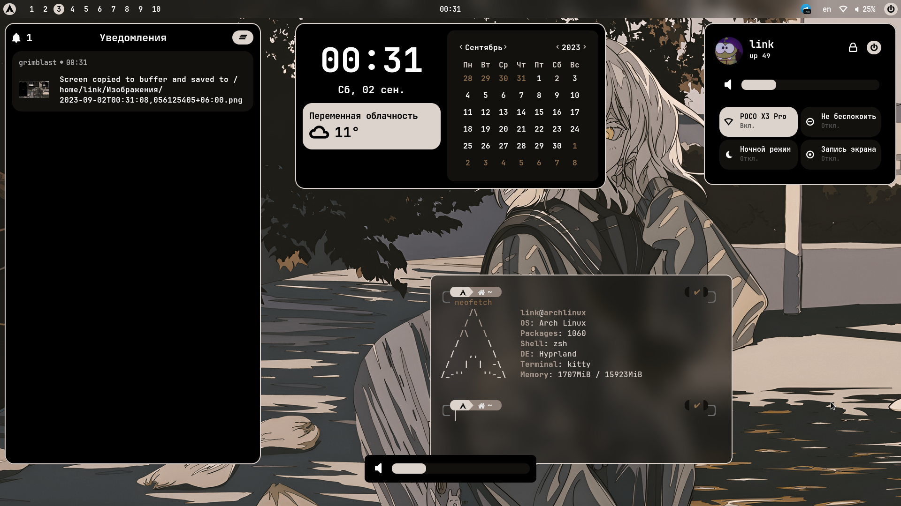
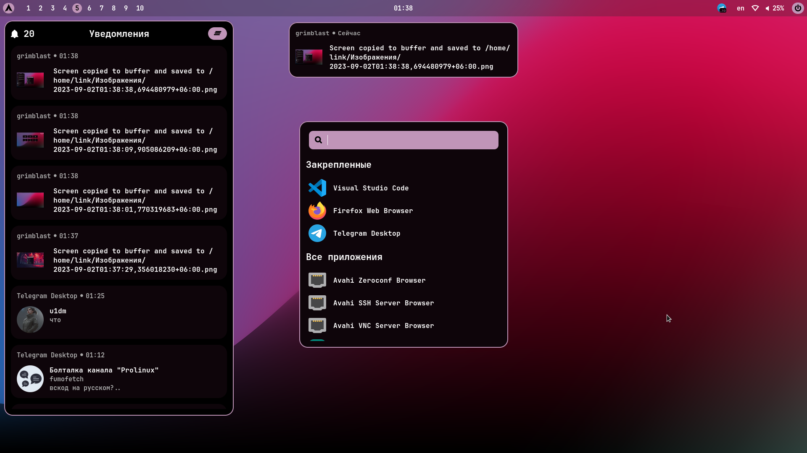
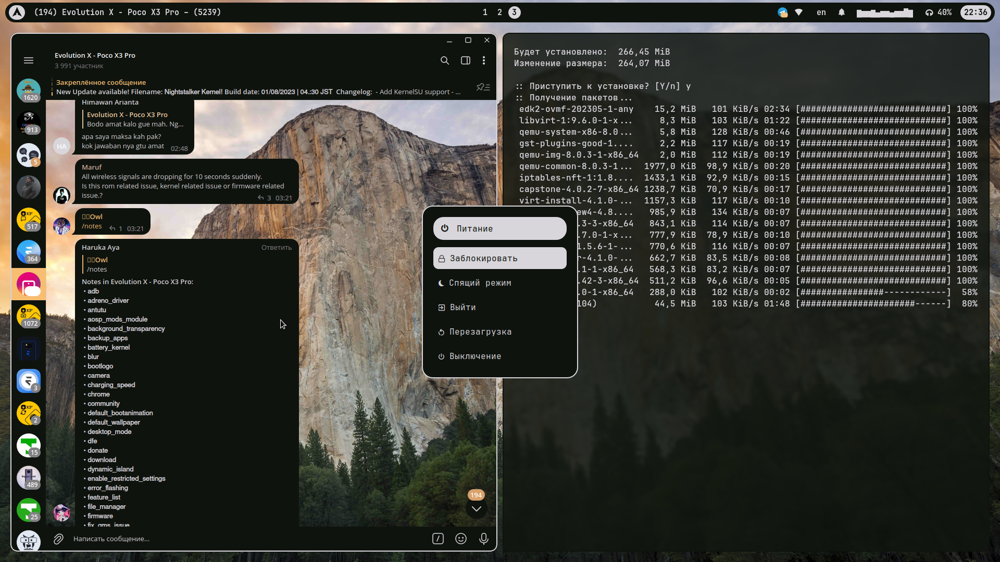
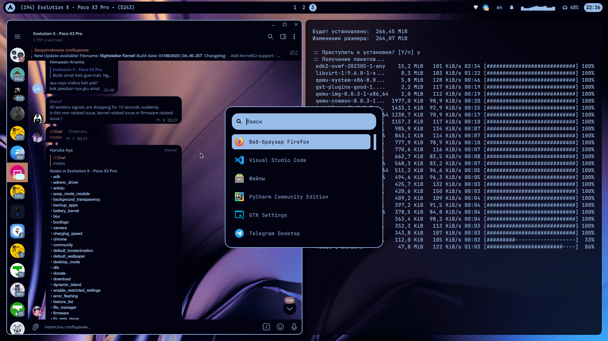

<div align="center">
  <h2><b><i>Material eww</i></b></h2>
  
  
  
</div>







## Software
- **Distro** - [Arch](https://archlinux.org/)
- **Wayland compositor** - [Hyprland](https://hyprland.org/)
- **Widgets** - [Eww](https://github.com/elkowar/eww)
- **File Manager** - [Thunar](https://gitlab.xfce.org/xfce/thunar)
- **Terminal** - [Kitty](https://sw.kovidgoyal.net/kitty/)
- **Wallpaper** - [swww](https://github.com/Horus645/swww)
- **Screen locker** - [gtklock](https://github.com/jovanlanik/gtklock)

## Installation

### Hyprland Nvidia
```
hyprland-nvidia-git
libva-nvidia-driver-git
nvidia-dkms
```

### Hyprland not nvidia
```
hyprland-git
```

### Hyprland base
```
xdg-desktop-portal-hyprland
xorg-xwayland
qt5-wayland
qt6-wayland
qt5ct
qt6ct
libva
linux-headers 
```

### Pipewire
```
pipewire 
pipewire-alsa 
pipewire-pulse 
pipewire-jack 
pavucontrol
wireplumber
```

### Components
```
dunst
jq
eww-tray-wayland-git
polkit-gnome
swww
gtklock
pamixer 
cliphist
python-pywal
grimblast-git
gnome-control-center
kitty
thunar
thunar-archive-plugin 
file-roller 
gtk-engine-murrine 
gnome-themes-extra
xdg-user-dirs
wf-recorder
dbus-python
python-gobject
python-requests
socat
networkmanager
```

### Font
```
ttf-jetbrains-mono
ttf-nerd-fonts-symbols
papirus-icon-theme
```

## WARNING: GENERATE PYWAL COLORSCHEME
```
wal -i ~/.wallpaper/wallpaper3.png -n -t
```
