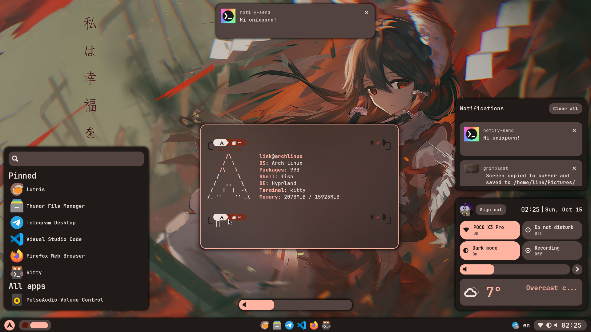
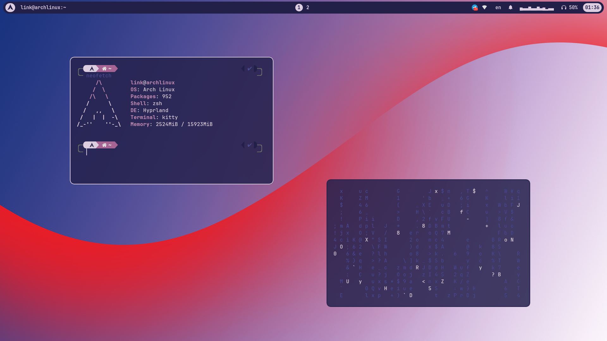
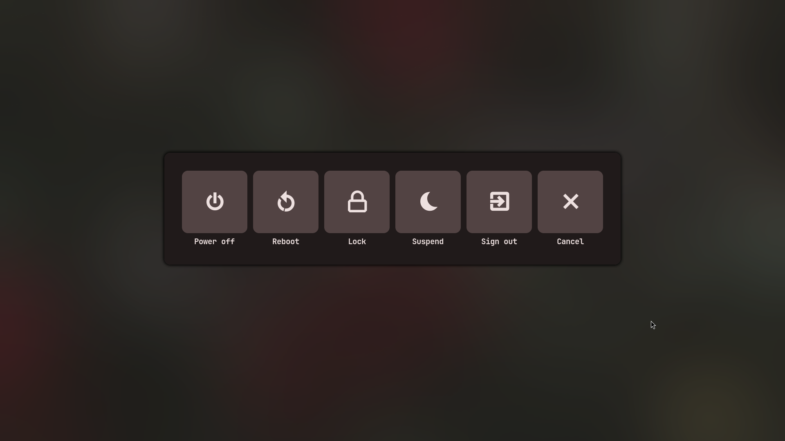

> [!WARNING]
> This branch is no longer maintained.
> If you plan to use it, you're on your own.

<div align="center">
    <h1>linkfrg's Hyprland(and eww!) dotfiles</h1>
    
    
    
</div>

## Gallery





## Features

- **Dynamic**: autogenerated material colors based on your wallpaper
- **Dark and light theme**: just toggle button in control center
- **Control center**: quick access to everything you need (probably)
- **Notifications**: notification daemon written on python with notifications center
- **Launcher**: you can pin and unpin apps, just right click on them


## How to install

### Install dependencies
Hyprland
```
hyprland xdg-desktop-portal-hyprland xorg-xwayland qt5-wayland qt6-wayland qt5ct qt6ct libva linux-headers 
```

If you use nvidia install also
```
libva-nvidia-driver-git
```

Pipewire
```
pipewire pipewire-alsa pipewire-pulse pipewire-jack pavucontrol wireplumber
```

Components
```
ripgrep playerctl gradience-git adw-gtk3-git jq eww-tray-wayland-git \
polkit-gnome swww gtklock pamixer grimblast-git gnome-control-center \
kitty thunar thunar-archive-plugin file-roller xdg-user-dirs \
wf-recorder dbus-python python-gobject python-requests python-jinja \
python-material-color-utilities zenity socat hyprpicker-git wget bc
```


Fonts and icons
```
ttf-jetbrains-mono ttf-nerd-fonts-symbols papirus-icon-theme
```

### Clone repo and configs
```
git clone https://github.com/linkfrg/dotfiles.git
cp -R dotfiles/.config/* ~/.config/
```

### Setup gtk theme, icon theme and font
```
gsettings set org.gnome.desktop.interface gtk-theme adw-gtk3
gsettings set org.gnome.desktop.interface icon-theme Papirus
gsettings set org.gnome.desktop.interface font-name "JetBrains Mono Regular 11"
```

### Enable pipewire
```
systemctl --user enable --now pipewire.service pipewire.socket pipewire-pulse.service wireplumber.service
```

### User dirs
```
LC_ALL=C xdg-user-dirs-update --force
```

## Keybindings

This a cheat sheet with some keybindings

### eww
| Bind | Action |
| ---- | ------ |
| `Super` + `F` | Select wallpaper |
| `Super` + `Shift` + `F` | Generate wallpaper from accent color |
| `Super` + `Z` | Toggle Launcher |
| `Super` + `X` | Toggle Control Center |
| `Super` + `M` | Toggle Powermenu |
| `Super` + `U` | Color Picker |

### Software
| Bind | Action |
| ---- | ------ |
| `Super` + `Q` | Open Kitty |
| `Super` + `L` | Lock screen |
| `Super` + `E` | Open Thunar |
| `Super` + `Shift` + `S` | Make screenshot from area |
| `Print screen` | Make fullscreen screenshot |

### Launcher
| Bind | Action |
| ---- | ------ |
| `Right click` on app from `All apps` list | pin app |
| `Right click` on app from `Pinned` list | unpin app |

### Windows
| Bind | Action |
| ---- | ------ |
| `Super` + `C` | Close window |
| `Super` + `Shift` + `M` | Force quit Hyprland |
| `F11` | Make window fullscreen |
| `Super` + `G` | Center window |
| `Super` + `D` | Pin window |
