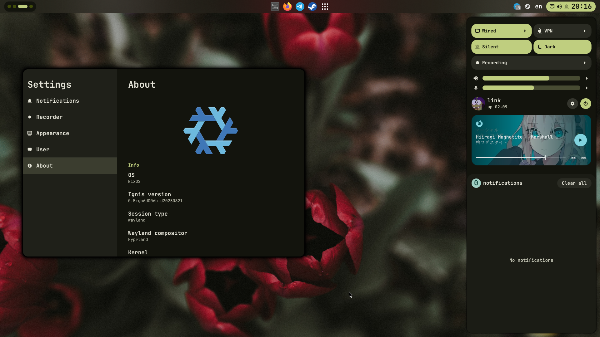

    <h1>linkfrg's Hyprland(and Ignis!) dotfiles</h1>

## Features

- **Dynamic**: Autogenerated material colors based on your wallpaper
- **Dark and light theme**: Just toggle button in control center
- **Control center**: Quick access to everything you need
- **Settings app**: GUI app to adjust Ignis options

## Installation

See [Installation](./docs/installation.md)

## Keybindings

See [Keybindings](./docs/keybindings.md)
